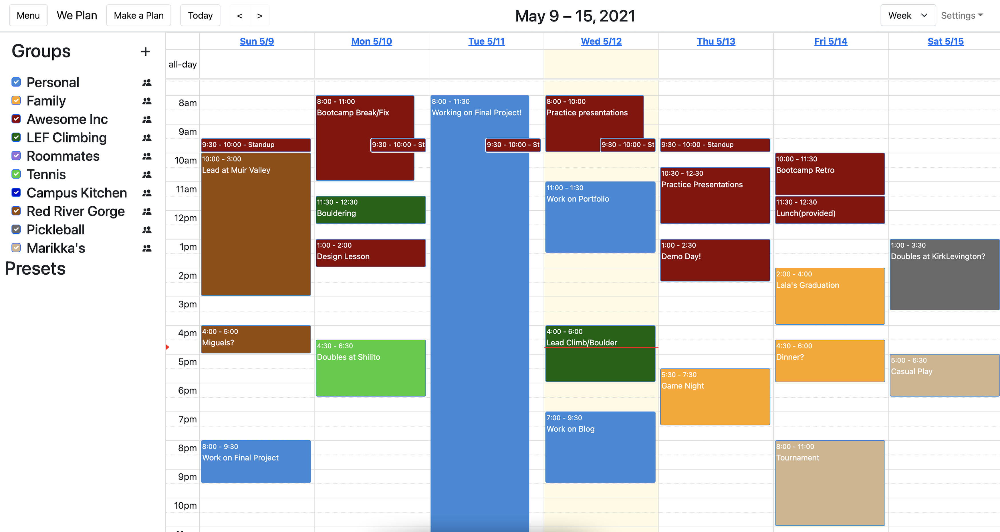

# We Plan - Google Calendar Meets the Rest of Social Media
Hey there! My name is Jimmy Zheng and this is the repo for my Final Project for my bootcamp as Awesome Inc U
  
Using packages such as FullCalendar and Axios with React and Laravel frameworks, this app aims to improve user experience, by limiting the amount of distracting notifications from many group chats, for socialites who engage in many social networks. 

Click [here](https://github.com/Jzhen123/WePlan-BackEnd) to check out the backend repo for the project!

## Example View

